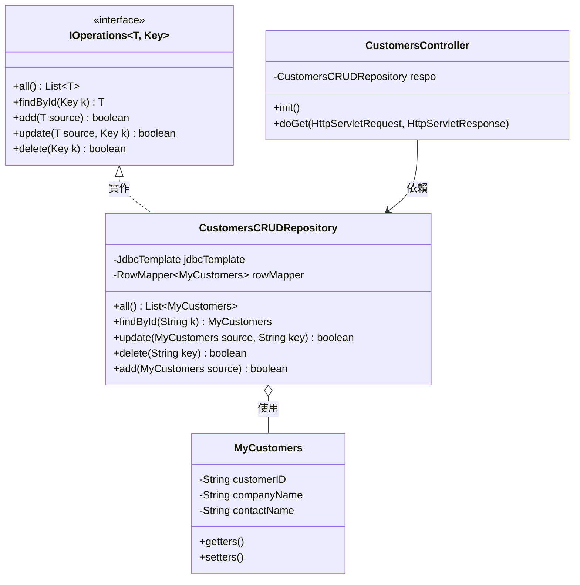

# MyWeb 專案資料存取架構文件

本文件詳細說明 `MyWeb` 專案中關於「客戶資料維護」功能的資料存取策略、類別設計與處理流程。

## 1. 資料存取策略架構圖 (Architectural Overview)

本專案採用分層架構，並結合 Spring Framework 的相依注入 (DI) 機制，將 Web 請求處理與資料存取邏輯解耦。

```mermaid
graph TD
    Client[瀏覽器 Client] -->|HTTP GET /customers/all| Controller[CustomersController]
    subgraph Spring Context
        Controller -->|@Autowired| Repo[CustomersCRUDRepository]
        Repo -->|使用 JdbcTemplate| DB[(SQL Server NORTHWND)]
    end
    Repo -.->|實作| Interface[IOperations 介面]
    Repo -.->|使用| Model[MyCustomers 實體類別]
    Controller -->|轉發| View[customers.jsp]
```

## 2. 類別圖 (Class Diagram)

類別圖展示了資料存取層的介面規範與具體實作之間的關係。



## 3. 循序圖 (Sequence Diagram) - 查詢所有客戶資料流程

以下呈現當使用者存取 `/customers/all` 時，系統內部的處理流程。

```mermaid
sequenceDiagram
    participant User as 使用者 (Browser)
    participant Ctrl as CustomersController
    participant Spring as Spring Framework
    participant Repo as CustomersCRUDRepository
    participant DB as SQL Server (NORTHWND)
    participant JSP as customers.jsp

    User->>Ctrl: 存取 /customers/all (GET)
    Note over Ctrl: 初始化時透過 SpringBeanAutowiringSupport 注入 Repo
    Ctrl->>Repo: 呼叫 all()
    Repo->>DB: 執行 SQL: SELECT * FROM Customers
    DB-->>Repo: 回傳 ResultSet
    Note over Repo: 使用 RowMapper 轉換為 List&lt;MyCustomers&gt;
    Repo-->>Ctrl: 回傳 List&lt;MyCustomers&gt;
    Ctrl->>Ctrl: 設定 Request Attribute "customers"
    Ctrl->>JSP: forward 轉發至 JSP
    JSP-->>User: 回傳 HTML (含總筆數與內容)
```

## 4. 技術重點說明

### 4.1 介面隔離 (Interface Segregation)
使用泛型介面 `IOperations<T, Key>` 定義了標準的 CRUD 規範，這使得資料存取層具有良好的擴充性與一致性。

### 4.2 反向控制與相依注入 (IoC & DI)
雖然使用傳統的 `HttpServlet`，但透過在 `init()` 方法中呼叫 `SpringBeanAutowiringSupport.processInjectionBasedOnCurrentContext(this)`，成功將 Spring 容器管理的 `CustomersCRUDRepository` 注入到 Servlet 中，結合了傳統 Java Web 與 Spring 的優點。

### 4.3 資料映射 (Object-Relational Mapping)
直接使用 Spring `JdbcTemplate` 配合自定義的 `RowMapper`，精確控制 SQL 執行細節並將關聯式資料轉換為 Java 物件 (`MyCustomers`)。

### 4.4 配置管理
資料庫連線資訊統一管理於 `application.properties`，並透過 Spring Boot 自動配置 `DataSource` 與 `JdbcTemplate`。
