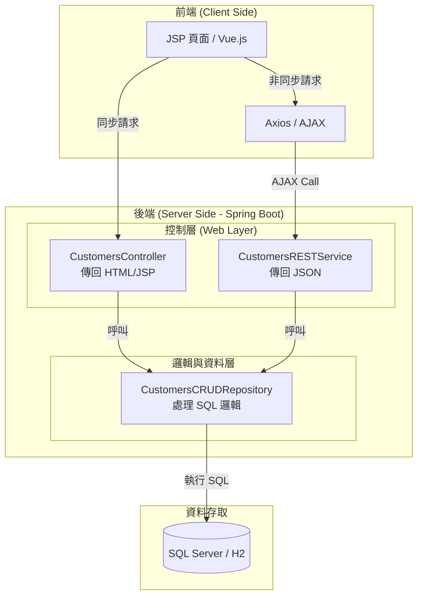
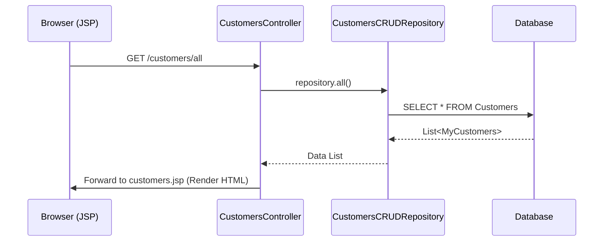
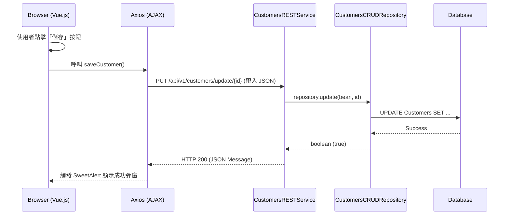

# CRUD 功能架構詳細說明文件

本文件詳細說明本專案中「增、刪、查、改 (CRUD)」功能的技術架構、元件分工以及資料流動方式。

---

## 一、 系統架構圖 (Architecture Diagram)

本系統採用分層架構，將使用者介面、控制邏輯與資料存取解耦。

---

## 二、 元件功能說明

| 層級 | 關鍵檔案 | 職責說明 |
| :--- | :--- | :--- |
| **View (視圖)** | `customers.jsp` `index.jsp` | 負責 UI 佈局。`index.jsp` 透過 Vue.js 驅動介面，實現 SPA (單頁應用) 體驗。 |
| **Controller (同步控制)** | `CustomersController` | **Read (查)** 的進入點。負責「第一次」開啟網頁時，抓取資料並渲染成 HTML。 |
| **REST Service (API)** | `CustomersRESTService` | **Create (增)、Update (改)、Delete (刪)** 的核心。透過端點接收 JSON 並執行動作。 |
| **Repository (資料存取)** | `CustomersCRUDRepository` | 封裝所有 SQL 語法。不管是傳統 Controller 還是 REST Service 都共用此層。 |

---

## 三、 循序圖 (Sequence Diagrams)

### 1. 查詢 (Read) - 傳統同步流程
當使用者輸入網址進入客戶清單頁面時。

### 2. 增/刪/改 (CUD) - 非同步 AJAX 流程
以「編輯資料」為例，展示前端如何透過端點觸發後端 Function。

---

## 四、 端點 (Endpoint) 與連通邏輯

CRUD 操作與程式碼的映射關係如下：

| 操作 | HTTP Method | 端點 (Endpoint URL) | 對應 Java 方法 |
| :--- | :--- | :--- | :--- |
| **新增 (C)** | `POST` | `/api/v1/customers/add` | `addCustomers()` |
| **查詢 (R)** | `GET` | `/api/v1/customers/all` | `customersAll()` |
| **修改 (U)** | `PUT` | `/api/v1/customers/update/{id}` | `updateCustomers()` |
| **刪除 (D)** | `DELETE` | `/api/v1/customers/delete/{id}` | `deleteCustomers()` |

---

## 五、 優勢總結
1.  **使用者介面不刷新**：操作流暢，像使用桌面軟體一樣。
2.  **責任分離**：Controller 只管頁面顯示，REST 只管資料處理。
3.  **高度可擴展**：未來若有手機 App 需求，可直接使用同一組 REST API 端點。
