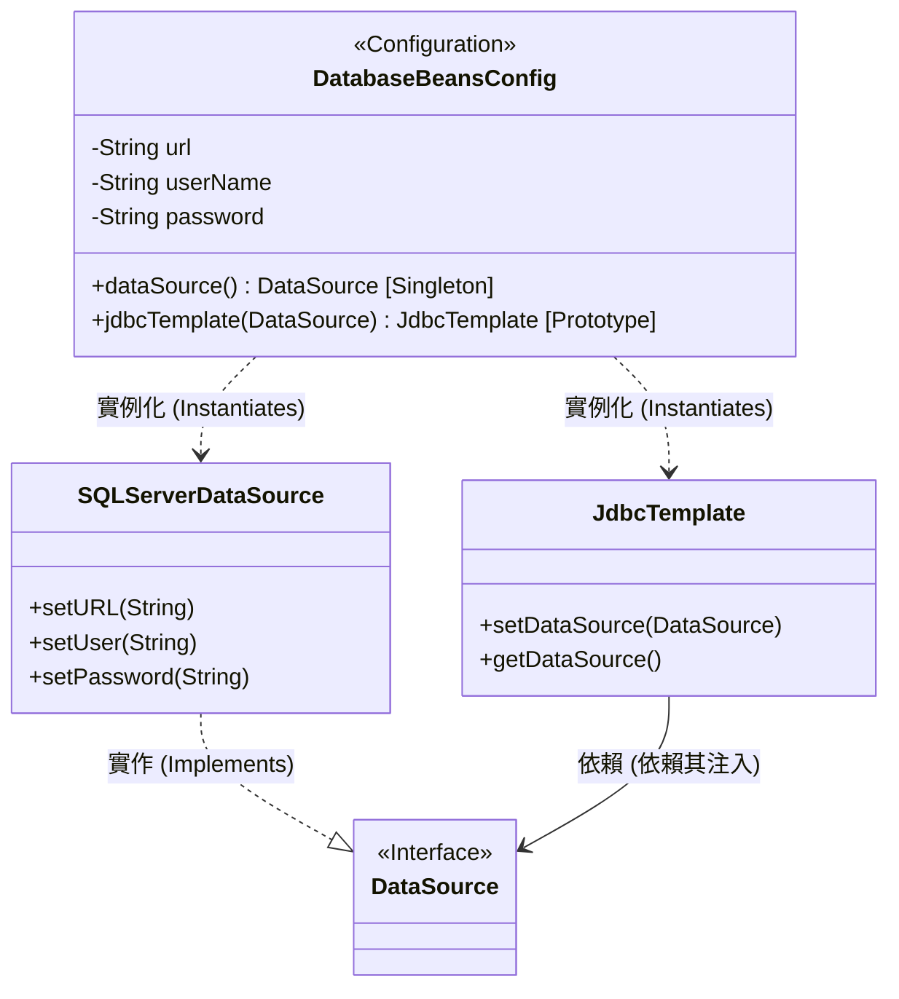
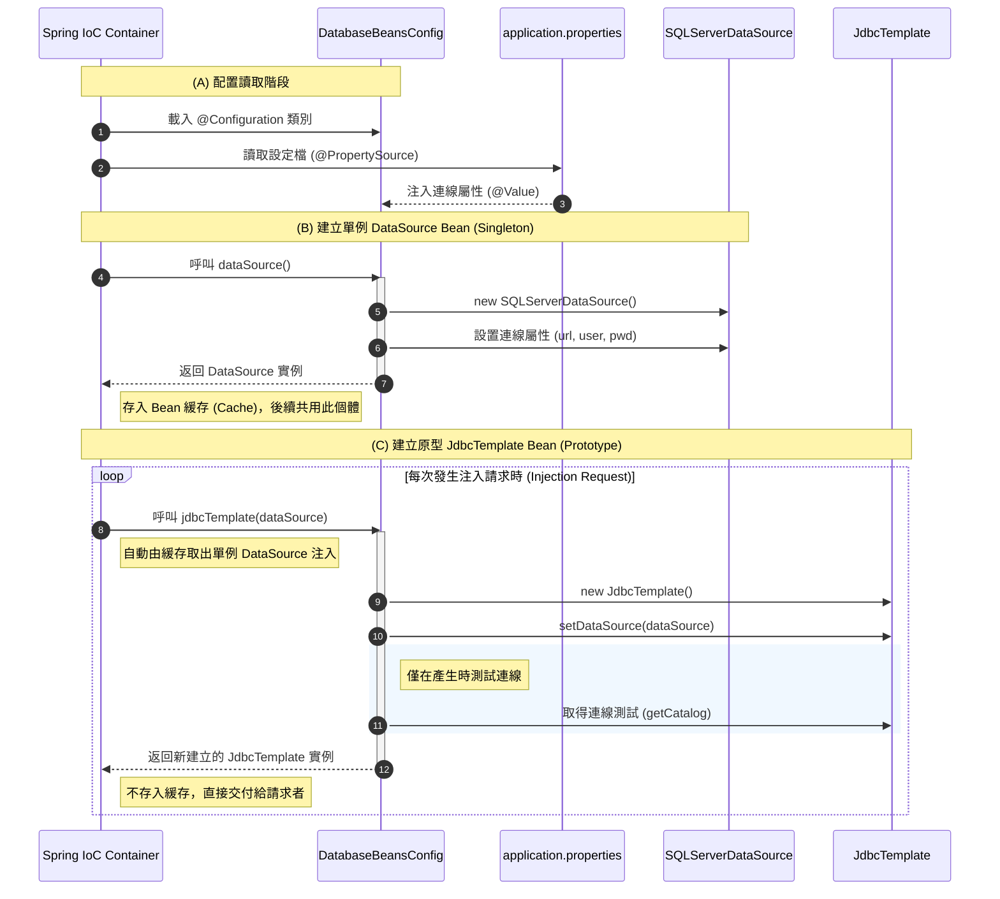

# MyWeb DatabaseBeansConfig 架構與流程說明 (更新版)

這份文件詳細說明了 `com.beans.DatabaseBeansConfig` 類別在 MyWeb 專案中的角色、架構設計以及運作流程，並包含了關於 **Bean Scope (作用域)** 的最新配置。

## 1. 整體架構概念

`DatabaseBeansConfig` 扮演著 **Spring 配置 (Configuration)** 與 **工廠 (Factory)** 的角色。它的主要職責是負責生產並組裝應用程式所需的資料庫連線物件。

*   **工廠設計模式 (Factory Pattern)**: 透過類別中的方法 (標註 `@Bean`) 來生產物件。
*   **依賴注入 (Dependency Injection)**: 
    *   利用 `@Value` 從 `application.properties` 注入連線字串、帳號與密碼。
    *   利用方法參數 (`jdbcTemplate(DataSource datasource)`) 實現 Bean 之間的依賴注入。
*   **作用域管理 (Bean Scopes)**:
    *   **Singleton (單例)**: `DataSource` 採用單例模式，確保整個應用程式共用同一個連線池工廠。
    *   **Prototype (原型)**: `JdbcTemplate` 採用原型模式，每次被 Controller 或是其他元件注入時，都會產生一個新的個體物件。

## 2. 類別結構圖 (Class Diagram)

展示類別關係與對應的作用域設定。



## 3. 執行流程與循序圖 (Sequence Diagram)

此圖說明 Spring 容器如何初始化這些 Bean，並區分了單例與原型的行為模式。



## 4. 關鍵配置與作用域解析

### 4.1 核心註解
*   `@Configuration`: 定義此類別為 Bean 的來源工廠。
*   `@Bean`: 標記方法產生的物件受 Spring 容器管理。
*   **`@Scope("singleton")`**: (預設值) 表示該 Bean 在 Spring 容器中只會存在一個實例。適用於 `DataSource`，因為連線池工廠通常只需要一個。
*   **`@Scope("prototype")`**: 表示每次從容器取得 (getBean) 或注入該 Bean 時，都會重新呼叫方法產生一個新物件。適用於 `JdbcTemplate` 來確保每個操作單元擁有獨立的樣板狀態。

### 4.2 依賴傳遞流程
1.  **外部配置注入**: `application.properties` -> `DatabaseBeansConfig` 屬性。
2.  **單例 Bean 注入原型 Bean**: `DataSource` (Singleton) 被自動注入到 `jdbcTemplate` (Prototype) 方法中。即使 `JdbcTemplate` 是新的，它們底層連結的 `DataSource` 依然是同一個，保證了資源的集中管理。

### 4.3 連線測試邏輯
在 `jdbcTemplate` 建立過程中，透過 `template.getDataSource().getConnection().getCatalog()` 進行即時測試。這有助於在開發階段 (或是每次產生新物件時) 確保資料庫連線鏈路是暢通的。

## 5. 應用範例：在 Controller 中使用

在 `MemberRegister` Servlet 中，透過 `@Autowired` 進行 **Field Injection (欄位注入)**。

```java
@WebServlet(name = "MemberRegister", urlPatterns = "/member/register")
public class MemberRegister extends HttpServlet {
    // DI Field Injection：透過型別 JdbcTemplate 向容器請求 Bean
    @Autowired
    private JdbcTemplate jdbcTemplate; 

    protected void doGet(...) {
        // 由於 JdbcTemplate 為 Prototype，每次請求注入時都會由工廠產生物件
        System.out.println("JdbcTemplate物件:" + this.jdbcTemplate);
    }
}
```

### 注入流程說明：
1.  **容器掃描**：Spring 掃描到 `@WebServlet` 標註的類別（需配合 `@ServletComponentScan`）。
2.  **型別匹配**：看到 `@Autowired` 標註在 `JdbcTemplate` 型別上。
3.  **呼叫工廠**：容器回頭呼叫 `DatabaseBeansConfig` 中的 `jdbcTemplate()` 方法。
4.  **物件交付**：由於是 `prototype` 作用域，容器產生一個全新的 `JdbcTemplate` 實例並注入到該欄位中。
