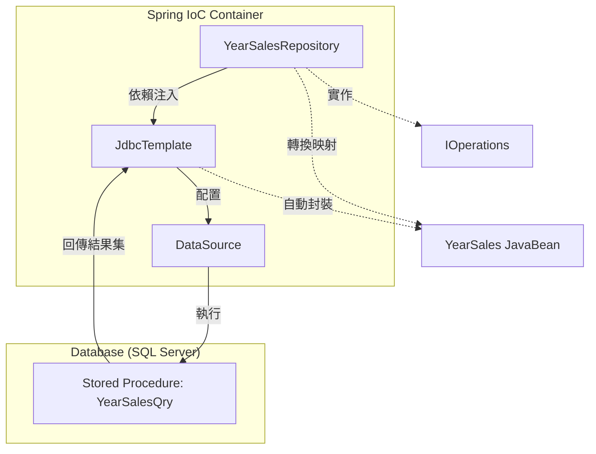
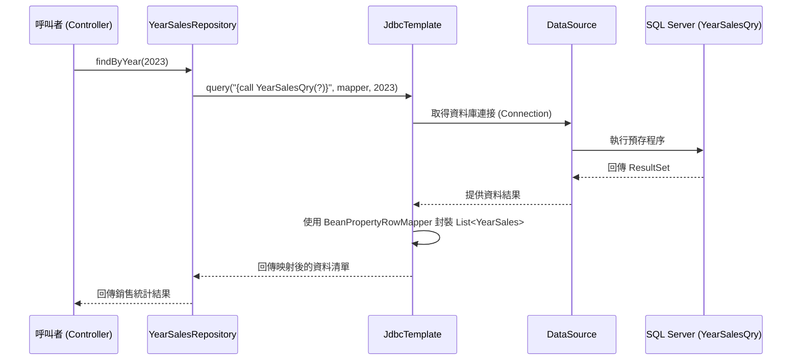

# StoreProcedureDemo - YearSalesRepository 運行架構說明

本文件詳細說明專案 `myweb` 中，關於 `YearSalesRepository` 呼叫資料庫預存程序（Stored Procedure）的運行架構、類別職責與處理流程。

## 1. 運行架構圖解

下圖展示了系統從 Repository 層透過 Spring JDBC 工具呼叫資料庫預存程序的架構關係：

## 2. 類別說明

### 2.1 [YearSales.java](file:///d:/巨匠/Java%20Web全端開發實務班/Java_code/MyWork/MyWeb/src/main/java/com/gjun/model/YearSales.java)
- **類型**：領域模型 (Domain Model / JavaBean)。
- **職責**：封裝單筆年度銷售數據。
- **欄位**：包含 `year`, `productID`, `productName`, `totalAmt`, `totalQty` 等，對應資料庫回傳的欄位名稱。

### 2.2 [IOperations.java](file:///d:/巨匠/Java%20Web全端開發實務班/Java_code/MyWork/MyWeb/src/main/java/com/gjun/repository/IOperations.java)
- **類型**：泛型介面。
- **職責**：定義標準的 CRUD 操作規範（all, findById, add, update, delete），確保資料存取層的一致性。

### 2.3 [YearSalesRepository.java](file:///d:/巨匠/Java%20Web全端開發實務班/Java_code/MyWork/MyWeb/src/main/java/com/gjun/repository/YearSalesRepository.java)
- **類型**：Repository 元件 (Spring @Repository)。
- **職責**：
    - 實作 `IOperations` 介面。
    - 透過 `@Autowired` **建構子注入** `JdbcTemplate`。
    - 使用 `{call YearSalesQry(?)}` 語法呼叫 Stored Procedure。
    - 利用 `BeanPropertyRowMapper` 將 SQL `ResultSet` 自動映射為 `YearSales` 物件。

## 3. 處理循序圖 (Sequence Diagram)

下圖展示了呼叫 `findByYear` 方法時的完整物件互動流程：

## 4. 關鍵技術點
- **Stored Procedure 呼叫**：採用 JDBC 標準轉義法 `{call SP_NAME(?)}`，相較於普通 SQL 能獲得更好的執行效能與維護性。
- **自動化映射**：透過 `BeanPropertyRowMapper`，開發者無需手動處理 `rs.next()` 或 `setXxx()`，大幅減少重複代碼並降低維護成本。
