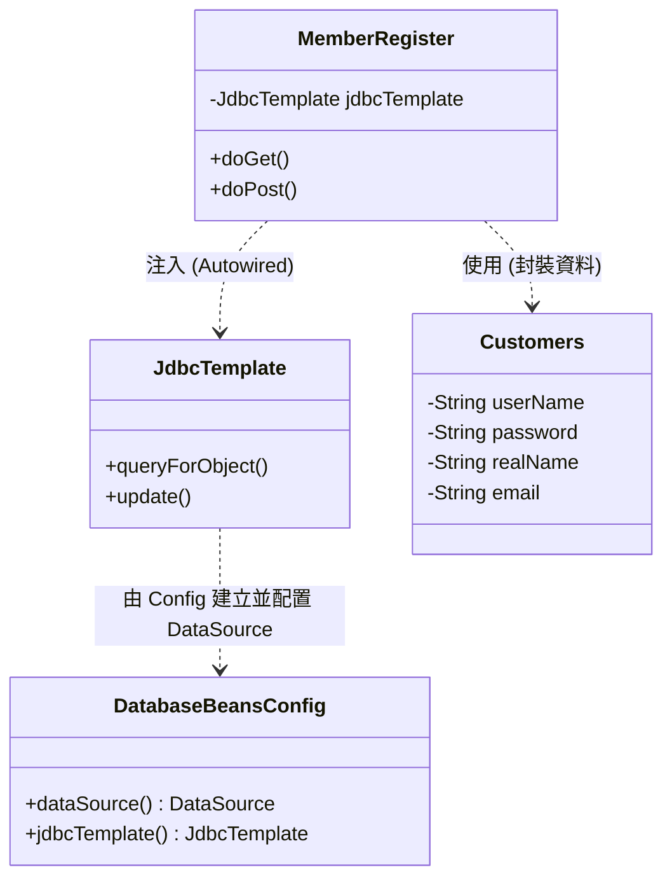
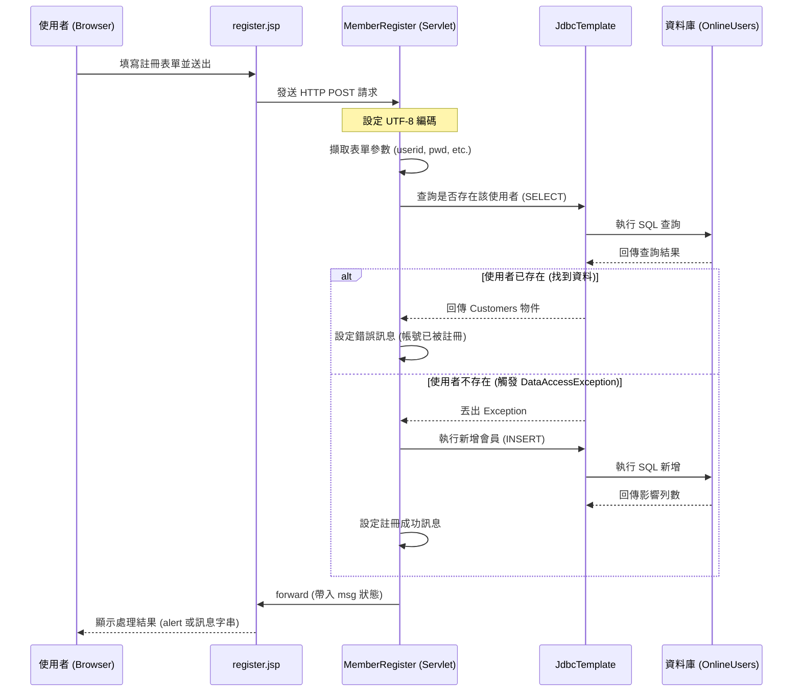

# 會員註冊功能架構與流程說明文件

本文檔詳細說明 `MyWeb` 專案中會員註冊功能的整體架構、類別依賴關係以及 Servlet 的處理流程。

## 1. 整體架構概述

本專案採用典型的 **MVC (Model-View-Controller)** 模式進行開發，結合 Spring Framework 提供的 `JdbcTemplate` 進行資料庫操作。

- **View (視圖層)**: 使用 `register.jsp` 提供使用者介面，負責收集會員資料並顯示處理結果。
- **Controller (控制層)**: 由 `MemberRegister.java` (Servlet) 擔任，負責接收請求、處理業務邏輯（如檢查重複、新增會員）並導向視圖。
- **Model (模型層)**: 使用 `Customers.java` 做為 JavaBean，封裝會員資料欄位。
- **Infrastructure (底層配置)**: 由 `DatabaseBeansConfig.java` 負責配置數據源 (`DataSource`) 與 `JdbcTemplate`。

---

## 2. 依賴類別架構

會員註冊功能的運作依賴於多個組件的協作。以下是其類別與組件之間的依賴關係：

- **MemberRegister**: 核心控制器，透過 `@Autowired` 從容器中取得 `JdbcTemplate`。
- **JdbcTemplate**: Spring 提供的 JDBC 工具類，簡化了 SQL 執行與結果對接。
- **Customers**: 用於在程式碼中傳遞與封裝會員資訊的 POJO (Plain Old Java Object)。
- **DatabaseBeansConfig**: 定義 Bean 的生產工廠，決定 `JdbcTemplate` 如何與 SQL Server 連接。

---

## 3. 處理循序圖 (Sequence Diagram)

以下呈現從使用者點擊註冊按鈕，到系統處理完畢並回傳結果的完整流程：

---

## 4. Servlet 細部流程詳細說明

`MemberRegister.java` 中的 `doPost` 方法是註冊邏輯的核心，其具體處理細節如下：

### A. 編碼與參數擷取
1. **Request 編碼**: 使用 `request.setCharacterEncoding("UTF-8")` 確保接收到的中文姓名（`realname`）不會產生亂碼。
2. **參數取得**: 透過 `request.getParameter()` 取得前端傳來的 `userid`, `password`, `realname`, `email`。
3. **Response 設定**: 使用 `resp.setContentType("text/html;charset=UTF-8")` 指定回應給瀏覽器的編碼格式。

### B. 重複檢查與資料存取邏輯
1. **既有帳號查詢**:
   - 使用 SQL: `Select ... from OnlineUsers where UserName=?`。
   - 透過 `jdbcTemplate.queryForObject` 搭配 Lambda 表達式 `(rs, number) -> { ... }` 將結果動態封裝進 `Customers` 物件。
   - **如果找到資料**: 表示帳號重複，程式會設定訊息告訴使用者「使用者名稱已經被註冊」。

2. **例外管理與新增動作**:
   - 由於 `queryForObject` 在找不到結果時會拋出 `DataAccessException`，開發者利用 `try-catch` 捕捉此例外。
   - **在 catch 區塊中**: 表示該帳號目前在資料庫中不存在，隨即執行 `insertInto` SQL 指令。
   - 調用 `jdbcTemplate.update()` 傳遞參數進行資料寫入。

### C. 狀態轉發 (Forwarding)
- 最後將處理後的 `message` 存入 `request.setAttribute("msg", message)`。
- 使用 `RequestDispatcher.forward()` 將請求帶回 `register.jsp`，使頁面能動態顯示成功或失敗的狀態。

---
> [!NOTE]
> 這種利用「找不到資料拋出例外」來判斷是否可以新增的邏輯，在 Web 開發中是一種常見的控制手段，能確保一次資料庫互動即可處理完成。
