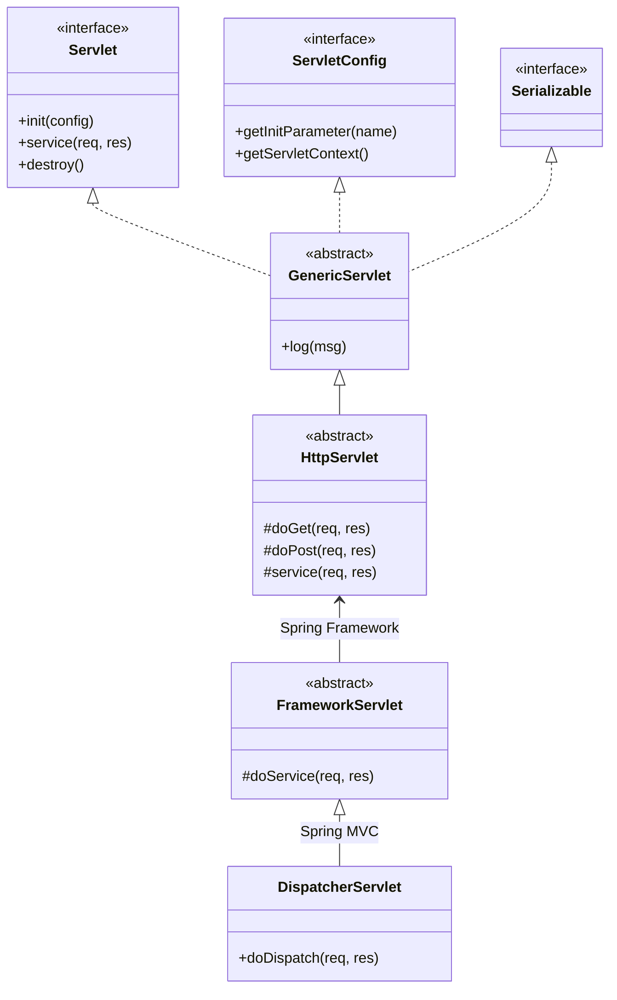

# MyWeb 專案：Servlet API 架構文件

本文件整理了 `MyWeb` 專案底層所使用的 **Jakarta Servlet 6.1** 架構細節、核心類別繼承關係以及與 Spring Boot 的整合方式。

---

## 1. Servlet 核心層級結構

Servlet API 的核心在於定義了網頁請求處理的標準規範。以下是從基礎介面到具體實作的繼承路徑：

### 核心介面與類別
1.  **`jakarta.servlet.Servlet` (Interface)**:
    - 所有 Servlet 的最頂層根基。
    - 定義了五個核心方法：`init()`, `service()`, `destroy()`, `getServletConfig()`, `getServletInfo()`。
2.  **`jakarta.servlet.GenericServlet` (Abstract Class)**:
    - 提供了一個通用的、協定無關的基底。
    - 實作了 `ServletConfig` 介面，簡化了日誌記錄和初始化參數的讀取。
3.  **`jakarta.servlet.http.HttpServlet` (Abstract Class)**:
    - 專門為 HTTP 協定設計的基類。
    - 重寫了 `service()` 方法，根據 HTTP 方法（GET, POST, PUT, DELETE 等）分發給對應的 `doXXX()` 方法。

---

## 2. Servlet 類別圖 (Class Diagram)

以下是使用 Mermaid 語法繪製的 Servlet API 類別圖，展示了從容器規範到 Spring MVC 實作的關係：

---

## 3. Servlet 生命周期 (Lifecycle)

Servlet 的生命周期由 Servlet 容器（在 Spring Boot 預設為內嵌式 Tomcat）管理：

1.  **載入與實例化**：容器根據配置（或 `@WebServlet` 註解）找到類別並建立實例。
2.  **初始化 (`init`)**：
    - 執行 `init(ServletConfig config)` 方法。
    - 此階段僅執行一次，用於分配資源（如資料庫連線池）。
3.  **請求處理 (`service`)**：
    - 每當有 HTTP 請求到達時，容器會開啟一個新的執行緒來呼叫 `service()`。
    - `HttpServlet` 會將請求分發給 `doGet`, `doPost` 等。
4.  **銷毀 (`destroy`)**：
    - 當 Web 應用停止或容器決定移除該實例時執行。
    - 此階段僅執行一次，用於釋放資源。

---

## 4. Spring Boot 整合架構

在 `MyWeb` 專案中，雖然您可能沒有手寫特定的 Servlet 類別，但 Spring Boot 透過 `spring-boot-starter-web` 自動完成下列配置：

-   **自動註冊 DispatcherServlet**：Spring Boot 會自動將 `DispatcherServlet` 註冊到 Servlet 容器中，並對照到 `/` 路徑。
-   **內嵌容器啟動**：Spring Boot 啟動時會同時啟動一個 Tomcat 實例，並將 Spring Context 中的所有 `Filter`, `Servlet`, `Listener` 豆組件 (Beans) 自動過渡到該 Servlet 容器中。
-   **Jakarta EE 10 支援**：本專案 Maven 配置顯示使用了 `jakarta.servlet-api:6.1.0`，這是 Jakarta EE 的最新標準，完全相容於 Java 17+。

---

> [!NOTE]
> 本文件由 Antigravity 自動生成，基於對 `pom.xml` 與專案結構的靜態分析。
