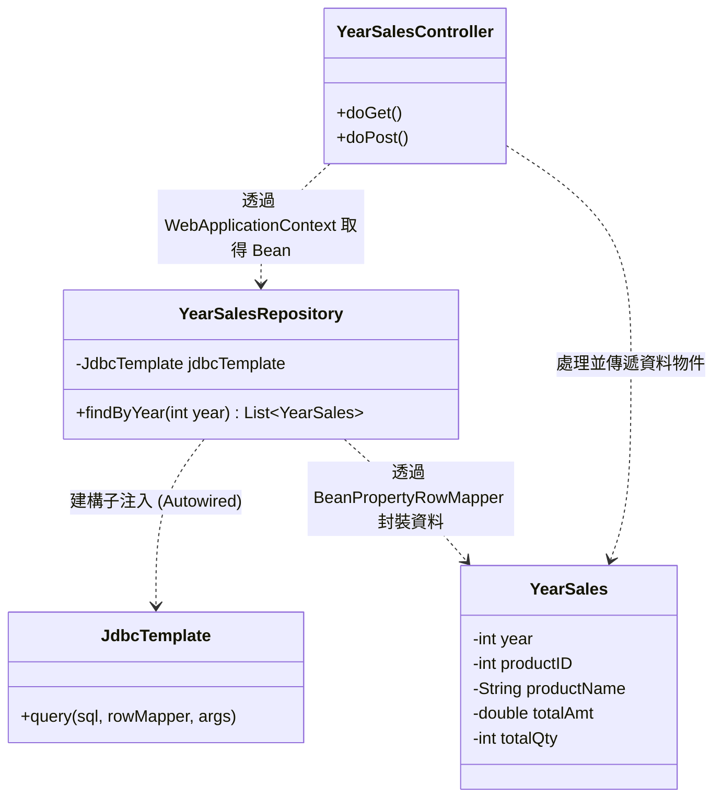
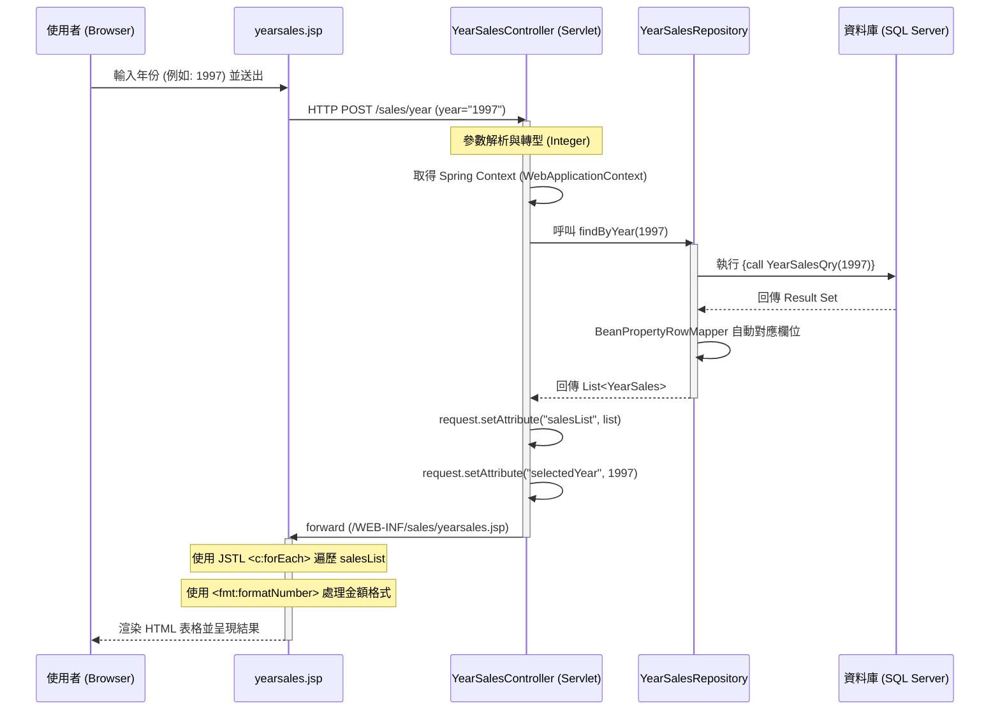

# 年度產品銷售分析功能架構說明文件

本文檔詳細說明 `MyWeb` 專案中「年度產品銷售分析 (`yearsales.jsp`)」功能的整體架構、類別依賴關係以及處理流程。

## 1. 整體架構概述

本功能採用 **MVC (Model-View-Controller) Model 2** 模式進行開發，並整合了 **Spring Framework** 的資料存取技術與 **SQL Server 預存程序 (Stored Procedure)**。

- **View (視圖層)**: `yearsales.jsp`。負責提供年度輸入表單，並以表格形式展示銷售統計結果。
- **Controller (控制層)**: `YearSalesController.java` (Servlet)。負責協調輸入驗證、呼叫 Repository 以及導向結果頁面。
- **Model (模型層)**: `YearSales.java` (JavaBean)。封裝從資料庫查詢出的年度銷售統計數據。
- **Data Access (資料存取層)**: `YearSalesRepository.java`。封裝與資料庫的互動邏輯，並使用 Spring `JdbcTemplate` 執行預存程序。

---

## 2. 類別依賴與組件架構

本功能的運作依賴於傳統 Servlet 與 Spring IoC 容器的協作。



- **WebApplicationContext**: 由於 Servlet 不受 Spring 直接管理，透過 `WebApplicationContextUtils` 在 `doPost` 中手動取得 `YearSalesRepository` 實例。
- **Stored Procedure**: 核心邏輯位於資料庫端的 `YearSalesQry` 預存程序，保證了查詢效能與邏輯封裝。

---

## 3. 處理循序圖 (Sequence Diagram)

以下呈現從使用者輸入年份查詢，到系統擷取預存程序結果並呈現的完整流程：



---

## 4. 詳細開發技術說明

### A. View 層 (yearsales.jsp & base.tag)
- **Tag Files**: 使用 `/WEB-INF/tags/base.tag` 定義統一的佈局架構，並引入 Bootstrap 5 與 Vue 3。
- **JSTL & EL**: 
    - `${selectedYear}`: 顯示目前正在檢視的年度。
    - `<c:if>`: 用於判斷是否顯示錯誤訊息或查詢結果。
    - `<c:forEach>`: 動態生成資料表格列。
- **格式化**: 使用 `<fmt:formatNumber>` 將 `totalAmt` 轉換為貨幣格式 (USD)。

### B. Controller 層 (YearSalesController)
- **Spring 端點串接**:
  ```java
  ServletContext servletContext = getServletContext();
  WebApplicationContext context = WebApplicationContextUtils.getWebApplicationContext(servletContext);
  YearSalesRepository repository = context.getBean(YearSalesRepository.class);
  ```
  這段程式碼是關鍵，它讓標準的 Java Servlet 能夠存取 Spring Container 中管理的 Bean（如 `YearSalesRepository`）。

### C. Data Access 層 (YearSalesRepository)
- **JdbcTemplate**: 使用 Spring 的 `JdbcTemplate` 取代傳統繁瑣的 JDBC (Connection, Statement, ResultSet) 撰寫方式。
- **Row Mapping**: `BeanPropertyRowMapper<>(YearSales.class)` 自動將資料庫欄位 (如 `productID`, `totalAmt`) 映射到 JavaBean 的屬性中，節省大量手動設定的時間。

### D. Model 層 (YearSales)
- **POJO 結構**: 定義為標準 JavaBean，所有欄位名稱與資料庫返回的欄位名稱（或別名）需保持一致，以便 `BeanPropertyRowMapper` 正常運作。

---
> [!TIP]
> **維護建議**: 若未來需要新增圖表分析（如 Chart.js），可以在 `yearsales.jsp` 的 Vue 區塊中，將 `${salesList}` 轉換為 JSON 格式供前端腳本使用。
