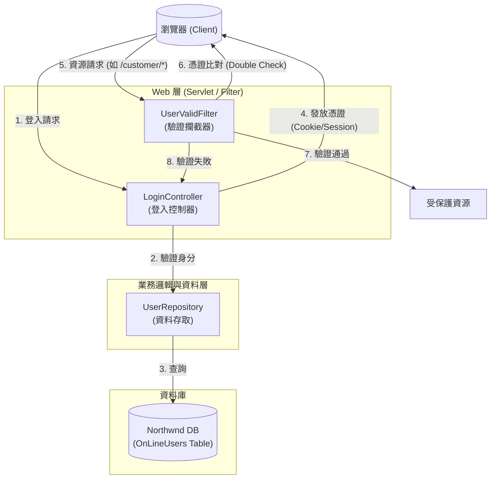
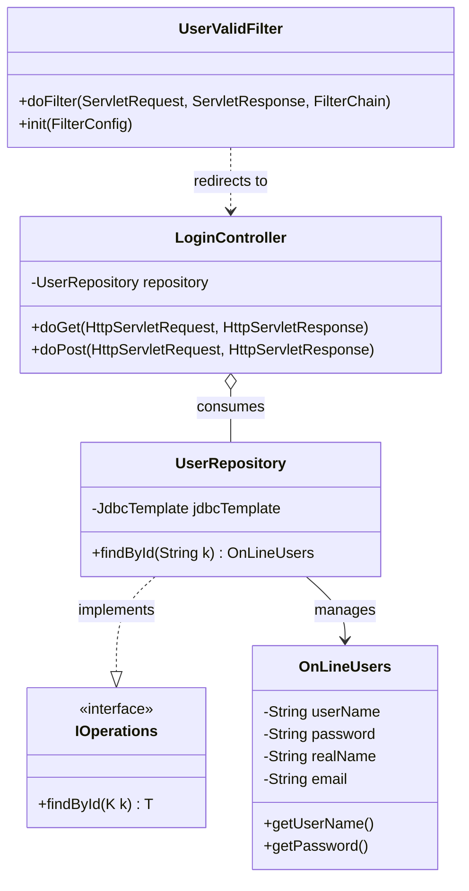
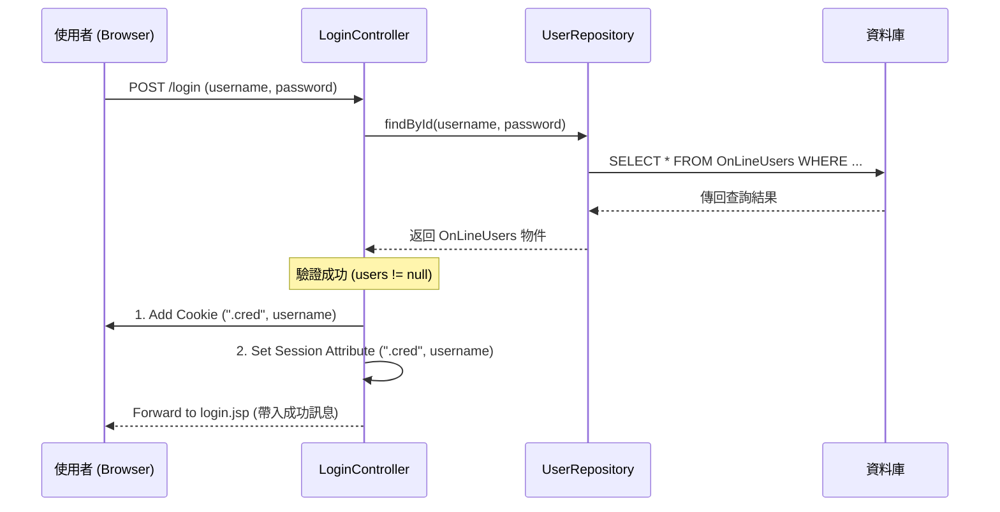
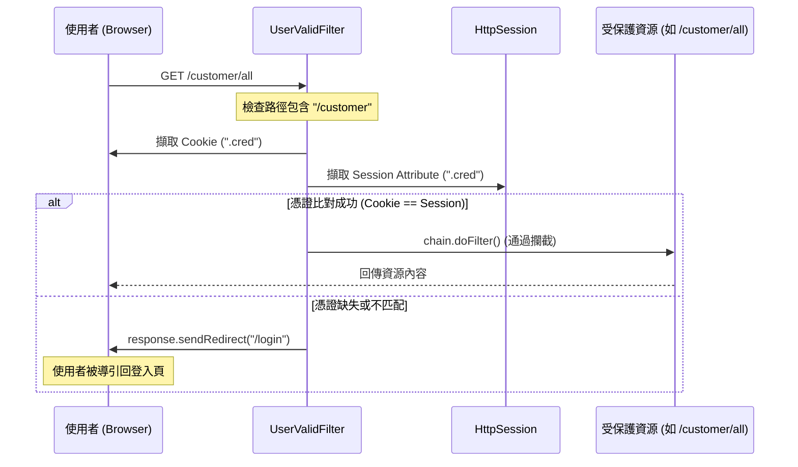

# 登入驗證與篩選流程架構文件

本文件整理了 `myweb` 專案中關於登入驗證、憑證發放以及 Filter 攔截驗證的完整架構。

## 1. 系統架構圖 (Architecture Diagram)

系統採用經典的 MVC 與分層架構，並透過 Servlet Filter 實現斷點攔截驗證。

---

## 2. 類別圖 (Class Diagram)

展示參與登入與驗證流程的核心類別及其關係。

---

## 3. 循序圖 (Sequence Diagram)

### 3.1 登入與憑證發放流程

描述使用者登入成功並取得憑證的過程。

### 3.2 資源存取與 Filter 攔截流程

描述使用者存取受保護資源時，Filter 如何進行攔截與驗證。

---

## 4. 關鍵實作說明

### 4.1 憑證安全性 (Security)
在 `LoginController` 中，憑證採取了以下安全措施：
*   **HttpOnly**: 防止 JavaScript 存取 Cookie，降低 XSS 攻擊風險。
*   **Secure**: 僅允許透過 HTTPS 傳輸憑證（在生產環境中非常重要）。
*   **SameSite=Lax**: 防止 CSRF（跨站請求偽造）攻擊，限制 Cookie 在跨站請求中的傳遞。

### 4.2 雙重驗證機制 (Double Check)
`UserValidFilter` 不僅檢查瀏覽器端是否有帶回 `Cookie`，還會同步比對伺服器端的 `HttpSession` 內容。只有當兩者皆存在且值相符時，才視為合法登入狀態。

### 4.3 攔截範圍
Filter 佈署於 `/*`，但僅針對路徑中包含 `/customer` 的請求進行強制驗證。其餘請求（如首頁、登入頁等）則直接放行。
