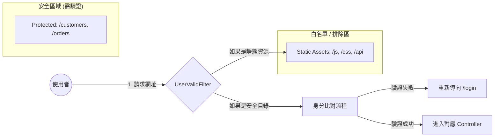
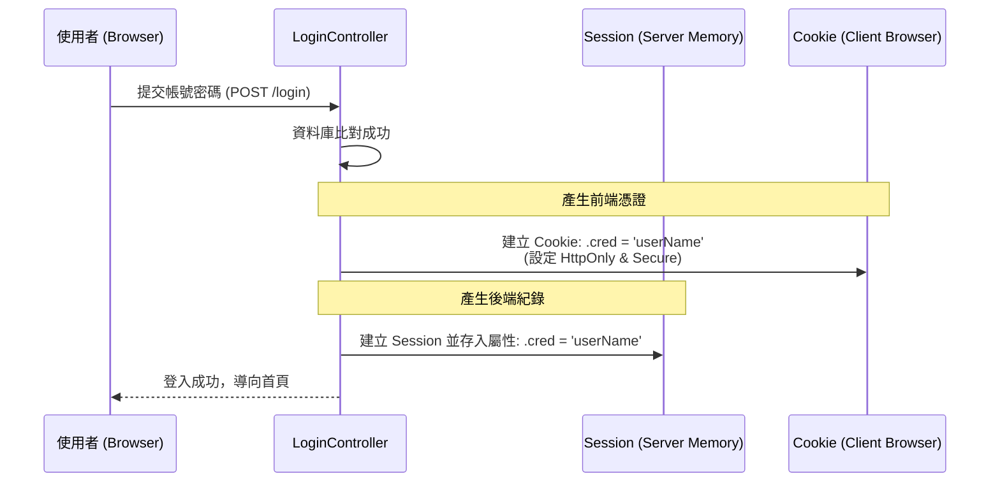
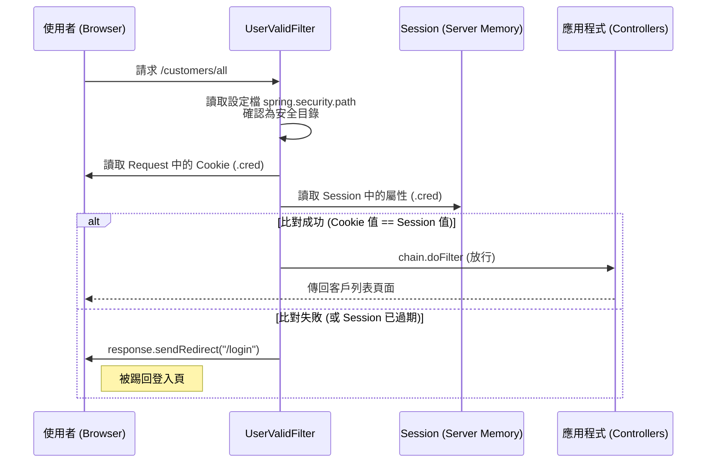

# 身分驗證與攔截器 (Filter) 技術說明文件

本文件詳細說明本系統如何透過 **Servlet Filter** 與 **Session/Cookie** 機制，建構一套安全的身分驗證攔截體系。

---

## 一、 安全過濾架構圖

Filter 作為系統的「保安」，位在所有請求的最前線。

---

## 二、 核心流程循序圖

### 1. 登入成功與憑證核發 (Login Flow)
當使用者在 `LoginController` 驗證成功時，系統會同時核發「前端暗碼」與「後端紀錄」。

### 2. 存取受保護資源 (Validation Flow)
當使用者要求進入 `/customers` 等安全路徑時，過濾器的攔截邏輯。

---

## 三、 資安防禦機制說明

### 1. 自定義暗碼：`.cred`
*   **非標準命名**：避開常見的 `SessionID` 或 `MemberID` 命名，讓駭客無法輕易看穿 Cookie 的用途。
*   **雙重核對 (Double Check)**：即便駭客自行在前端偽造一個 `.cred` Cookie，只要他無法攻破伺服器記憶體 (Session)，比對依然會失敗。

### 2. Cookie 安全三大本柱 (資安防護)

| 設定項目 | 作用說明 | 防禦效果 |
| :--- | :--- | :--- |
| **HttpOnly(true)** | 禁止瀏覽器端的 JavaScript 存取此 Cookie。 | 防止 **XSS (跨站快取攻擊)** 竊取憑證。 |
| **Secure(true)** | 規定 Cookie 僅能透過 HTTPS 加密連線傳送。 | 防止 **中途攔截 (Sniffing)** 竊取資料。 |
| **SameSite("Lax")** | 限制瀏覽器在跨站請求時發送 Cookie。 | 防止 **CSRF (跨站請求偽造)** 攻擊。 |

---

## 四、 啟動與掃描機制

本過濾器的啟動並非靠 `web.xml`，而是透過 **Annotation (標註)**：

1.  **類別標記**：在 `UserValidFilter` 使用 `@WebFilter(urlPatterns = { "/*" })`。
2.  **啟動掃描**：在 `MywebApplication` 使用 `@ServletComponentScan` 自動將帶有標籤的 Filter 註冊到系統中。

---

## 五、 配置導向管理 (Configuration Driven)

受保護的目錄清單定義在 `application.properties`：
`spring.security.path=/customers;/orders`

這使得管理人員無需修改 Java 核心程式碼，即可隨時動態調整網站的安全保護範圍。
